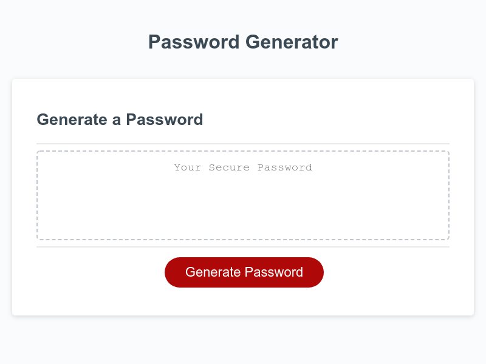

# random_password_generator

This random Password generator will create a password of the users desired lendth and character types as determined by a series of prompts.

## Description
This Random Password Generator was created using starter HTML and CSS code provided from the boot camp. My job was to implement my knowledge of Javascript to program a wording password generator. At this point in the bootcamp Javascript seemed the hardest program for me to grasp. My own research and the use of tutor sessions has proved invaluable.

## Usage
This random password generator was created so the user could randomly generate a password between the length of 8 and 128 characters. The promps provided allow the user to select what type of characters they want included in the password.

## Conclusion
Durning the creation of this generator I have learned Javascript skills. These skills include:

* Understanding the order in which you must define variables and functions.

* I gained more understanding of Javascript through research and review of class materials.

* I gained a better understanding if statements and how to use conditional statements.

* I implemented methods such as .splice and .push to change variable types.

* I acheived a better understanding for loops.

* I used my prior knowlegdge from our classes and independant research to discover what functions to use to randomize a selection from an array. 

## Screenshot

## Links
https://baldwisj.github.io/random_password_generator/